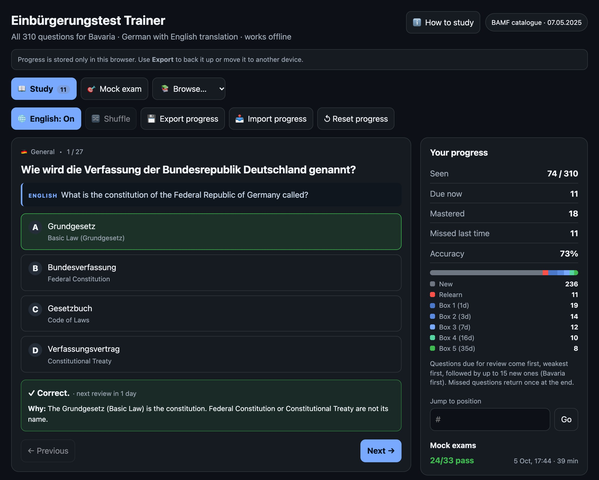

# Einbürgerungstest Trainer

A static, offline-capable trainer for the German naturalisation test (Einbürgerungstest), for all 16 federal states: 300 general questions plus the 10 questions of your state, 310 in total. German wording with English translations and a short explanation for every answer.

**Live site: https://einbuergerungstest-trainer-tan.vercel.app/**



*Screenshot with demo progress and the English translation switched on.*

## Features

- A state picker for all 16 federal states, asked on the first visit and changeable from the header any time. It only decides which 10 state questions you see; there is no location detection, and the choice is stored in the browser. Switching keeps all saved progress.
- 310 questions per learner (300 general plus the 10 of the chosen state; 460 in the full catalogue), including the figure questions, with English translations that are off by default and can be switched on with one click.
- Explanations after each answer.
- Spaced repetition (Leitner boxes): correct answers move a question to a longer review interval (1, 3, 7, 16, 35 days), a wrong answer sends it back to be relearned. The **Study** tab serves what is due first (weakest boxes first), then up to 15 new questions a day, your state's first. Once the day's new questions are done, a **Study 15 more** button adds another batch. The **Browse** menu filters the catalogue (all, general, your state, new, mistakes, mastered).
- Timed mock exam: 33 questions (30 general, 3 from your state), 60 minutes, pass mark 17. Answers can be changed until you finish, the clock survives a page reload, and the exam is submitted automatically when time runs out.
- A built-in "How to study" guide for newcomers: the test format, a daily routine, how the review schedule works and study tips. It opens from the header and is offered once to first-time visitors.
- Progress is stored in the browser's `localStorage`. Export and import it as JSON to back it up or move devices; exports from the original single-file trainer can be imported too.

## Run locally

No build step and no dependencies. Open `index.html` directly, or serve the folder:

```bash
npm start   # http://localhost:8080
```

```bash
npm test    # unit tests and data validation
```

## Layout

| Path | Purpose |
| --- | --- |
| `index.html`, `css/styles.css` | Page and styles (dark and light themes) |
| `js/srs.js` | Spaced-repetition scheduling |
| `js/exam.js` | Mock exam construction, scoring, clock |
| `js/catalogue.js` | The question set for one federal state |
| `js/storage.js` | Progress persistence, import and migration |
| `js/app.js` | UI |
| `data/states.js` | The 16 federal states and where their questions start |
| `data/questions.js` | Question catalogue (German, English, answer key) |
| `data/explanations.js` | Explanation per question id |
| `images/` | Figures for the picture questions |
| `sw.js` | Service worker for offline use over HTTP(S) |
| `scripts/validate-data.js` | Consistency checks for the data files |

Scripts are plain browser scripts, not ES modules, so the page also works from `file://`.

## Data

Questions and figures, including the state questions for all 16 federal states, come from the BAMF *Fragenkatalog zum Einbürgerungstest* (07.05.2025). The Reichstag photo for question 55 is by Gary Todd and released under CC0 via [Wikimedia Commons](https://commons.wikimedia.org/wiki/File:Reichstag_(28764267615).jpg). This project is an unofficial study aid and is not affiliated with the BAMF. The English translations and explanations are study aids; the German text is what the exam uses. Time-dependent questions (current Chancellor, largest parliamentary groups, population) reflect that edition and will need updating when the catalogue changes.

## Deploying

The site is plain static files: publish the repository root with no build command. It is hosted on Vercel and redeploys on every push to `main`.

## License

The code is released under the [MIT License](LICENSE). The question catalogue (`data/questions.js`) and the figures in `images/` come from the BAMF and are not covered by that license.
